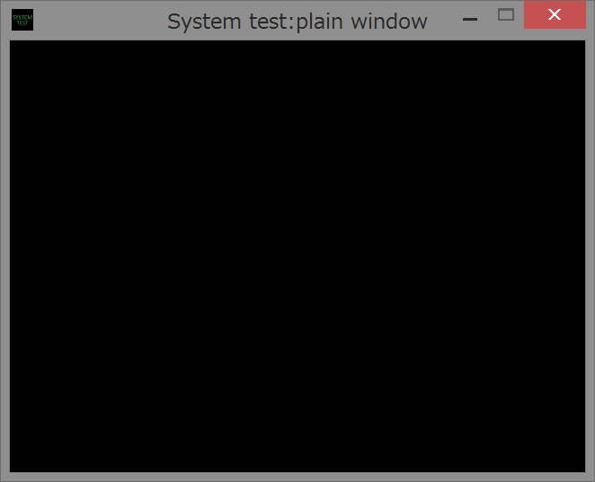

sample01 window
====
This sample shows you how to make a plain window.


General rules
----
Below things are general rules

 * Must be a windows programming
 * UNICODE build required
 * Can't be used in multi thread
 * Basic function must be called properly

Basic functions
----
These are three important functions that must be called from client application in proper time and number.

1. InitSystem
```
bool sys::InitSystem(HINSTANCE hinstance);
```
This function initializes system library. This must be called only once. Inside this function, a lot of components, e.g., COM, graphic device, sound device, are initialized. If this function succeeds, return value is true.

2. UpdateSystem
```
bool sys::UpdateSystem();
```
This function processes messages from Windows. This must be called for each loop. Thus, the client program must be written with one main loop. Before the call of this function, InitSystem must be called.

3. FinalizeSystem
```
void sys::FinalizeSystem();
```
This function finalizes system library. This must be called only once. Inside this function, a lot of components initialized in InitSystem are finalized. Before the call of this function, InitSystem must be called.

Window options
----
These are some function to set properties to the client window. These functions must be called before the call of InitSystem to have an effect.

1. SetWindowTitle
```
void sys::SetWindowTitle(const wchar_t* window_title);
```
This function sets window title.

2. SetWindowIcon
```
void sys::SetWindowIcon(IDI_ICON1);
```
This function sets window icon id. Icon id is a handle of icon that is defined and declared in resource.rc and resource.h respectively.

3. SetWindowSize
```
void sys::SetWindowSize(int x, int y);
```
This function sets window size. More precisely, this function designates client region size.

4. SetResolution
```
void sys::SetResolution(int x, int y);
```
This function sets graphic resolution. It is recommended that the resolution is same as or multiple of window size. In general, rough resolution makes your application faster.

5. StartWithFullscreen
```
void sys::StartWithFullscreen(bool full screen);
```
This function decides whether application starts with full screen or window. If full screen is true, application is launched in full screen mode.
This function decides whether application starts with full screen or window. If full screen is true, application is launched in full screen mode.

NOTE:<br>
This library is committed to simplicity, so the customizable properties are very limited. Things below are specifications that user can change

 * Frame rate (FPS) is fixed to 60 by using multi media timer
 * No menu bar
 * Fixed window limb

Useful functions
----
These are some useful function to get information of texture and image.

1. FillScreen
```
bool sys::FillScreen(const Color4b& color);
```
This function fills client region with specified color. This is useful to reset screen.

2. GetMilliSecond
```
int sys::GetMilliSecond();
```
This function returns time since the launch of the program in millisecond. The accuracy of this function is about 1 ms, though it depends on platform.

3. ErrorDialogBox
```
bool ErrorDialogBox(const wchar_t* format, ...);
```
This function display an error dialog and doesn't return control to client application until "OK" button is pressed. Error messages of this library is shown by this function.
