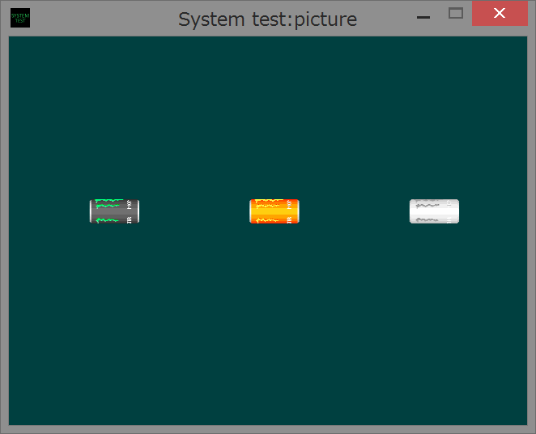

sample02 picture
====
This sample shows you how to use graphic structures and functions.<br>
Read sample01/README.md before reading this content.<br>
<br>

General rules
----
Below things are general rules

 * Graphic is image dependent
 * Texture and image data must be created before draw
 * Texture and image data are tied to id

Description structures
----
This library features structure and functions based interface. Some functions with alot of input data uses data description structures like some Windows library functions do.

1. ResourceDesc
```
struct ResourceDesc {
  std::wstring file_name;
  uint8_t* mem_ptr;
  size_t mem_size;
  bool use_mem;
  ResourceDesc();
};
```
This structure describes data file properties. If use_mem is false, the data source is set to file specified by file_name, rather the data source is set to memory block that address is pointed by mem_ptr. In the latter case, you have to set the size of memory block to mem_size.

2. TextureDesc
```
struct TextureDesc {
  ResourceDesc resource_desc;
  TextureDesc();
};
```
This structure describes texture data properties. TextureDesc includes ResourceDesc.

3. ImageDesc
```
struct sys::ImageDesc {
  int texture_id;
  int x;
  int y;
  int w;
  int h;
  double s;
  SYS_IMAGEMODE image_mode;
  ImageDesc();
};
```
This structure describes image data properties. When create an image, texture data is used to paste to image. You can cut texture by describing image top-left corner (x, y) and size (w, h). The clipped region can be scaled by s and the scaled region size becomes image size.<br>
SYS_IMAGEMODE is a enumerate for image operation such as reflect and rotation. These operations are done at creation time to reduces load of drawing.
```
enum SYS_IMAGEMODE {
  SYS_IMAGEMODE_DEFAULT,
  SYS_IMAGEMODE_HINVERT,
  SYS_IMAGEMODE_VINVERT,
  SYS_IMAGEMODE_ROT90,
  SYS_IMAGEMODE_ROT180,
  SYS_IMAGEMODE_ROT270,
};
```

|Label|Meaning|
|---|---|
|SYS_IMAGEMODE_DEFAULT|No operation is done to image (default)|
|SYS_IMAGEMODE_HINVERT|Invert image to horizontal direction|
|SYS_IMAGEMODE_VINVERT|Invert image to vertical direction|
|SYS_IMAGEMODE_ROT90|Rotate image 90 degrees clockwise|
|SYS_IMAGEMODE_ROT180|Rotate image 180 degrees clockwise|
|SYS_IMAGEMODE_ROT270|Rotate image 270 degrees clockwise|

Picture draw functions
----
These are some function related to picture draw.

1. CreateTexture
```
bool sys::CreateTexture(const TextureDesc& desc, int* texture_id);
```
This function creates a texture data from user designated image data file. These are some format exists can be used, e.g., png, jpeg, gif. The texture data is tagged with identical texture id. You can't use one texture id to multiple textures, despite a texture is released with ReleaseTexture. Error and duplicate id assign causes failure (return value is false), triggering error dialog.

2. ReleaseTexture
```
bool sys::ReleaseTexture(int texture_id);
```
This function releases texture data tagged with texture id. Error and duplicate release causes failure (return value is false), triggering error dialog.

3. CreateImage
```
bool sys::CreateImage(const ImageDesc& desc, int* image_id);
```
This function creates image data from user texture data. Image data is tagged to identical image id. Error and duplicate id assign causes failure (return value is false), triggering error dialog.

4. ReleaseImage
```
bool sys::ReleaseImage(int image_id);
```
This function releases image data tagged with image id. Error and duplicate release causes failure (return value is false), triggering error dialog.<br>
Don't call this function if the associated image to the texture is not released by CreateImage.

5. DrawImage
```
bool DrawImage(int image_id, const Vector2d& position, int alpha);
```
This function draws image tagged to image id to specified position. The alpha value of the image is adjustable through `alpha`.<br>
If the image id is invalid or expired, error dialog is triggered.

Overload
```
bool DrawImage(int image_id, const Vector2d& position);
```
The argument `alpha` is set to 255 as default.


Useful functions
----
These are some useful function to get information of texture and image.

1. GetTextureSize
```
bool GetTextureSize(int texture_id, Vector2d* size);
```
This function tells the size of texture that tagged to texture id.
If the texture id is invalid or expired, error dialog is triggered.

2. GetImageSize
```
bool GetImageSize(int image_id, Vector2d* size);
```
This function tells the size of image which tagged to image id.
If the image id is invalid or expired, error dialog is triggered.
