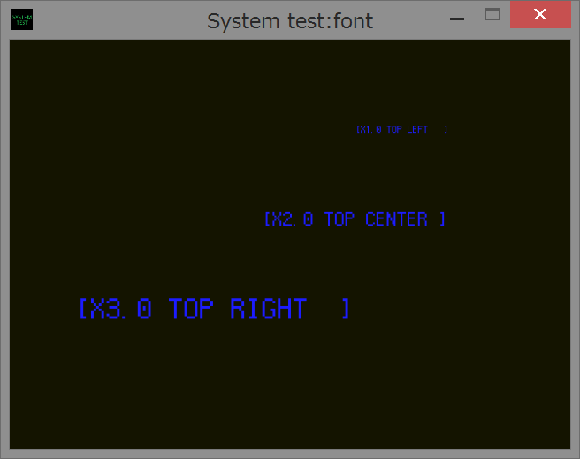
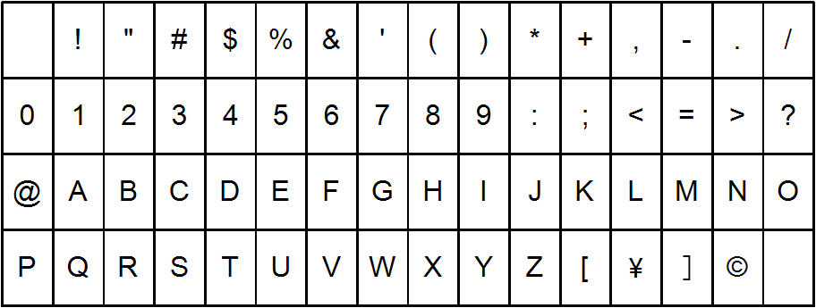
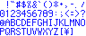

sample03 font
====
This sample shows you how to use font structures and functions.<br>
Read sample[01,02]/README.md before reading this content.<br>
<br>

General rules
----
Below things are general rules

 * Font is based on graphic functions
 * Using "Font table"
 * Font data must be created before draw
 * Font data is tied to id

Font table
----
Font data is actually a set of images aligned in one texture file in specific rule. The alignment of the character in font table is shown in the picture below<br>
<br>
An example is shown below<br>
<br>

Description structures
----
This library features structure and function based interface. Some functions with a lot of input data uses data description structures like some Windows library functions do.

1. FontDesc
```
struct sys::FontDesc {
  ResourceDesc resource_desc;
  double s;
  SYS_IMAGEMODE image_mode;
  FontDesc();
};
```
This structure describes data font properties. FontDesc includes ResourceDesc. You don't have to set ImageDesc to all of images that consists font data. If you want to create transverset font data, set image_mode to SYS_IMAGEMODE_ROT90 or SYS_IMAGEMODE_ROT270.

Font alignment
----
The enumeration SYS_FONTMODE designates how you place the text using DrawText function.

|label|description|
|---|---|
|SYS_FONTMODE_TOP_LEFT|The text is aligned in top left|
|SYS_FONTMODE_TOP_CENTER|The text is aligned in top center|
|SYS_FONTMODE_TOP_RIGHT|The text is aligned in top right|
|SYS_FONTMODE_MIDDLE_LEFT|The text is aligned in middle left|
|SYS_FONTMODE_MIDDLE_CENTER|The text is aligned in middle center|
|SYS_FONTMODE_MIDDLE_RIGHT|The text is aligned in middle right|
|SYS_FONTMODE_BOTTOM_LEFT|The text is aligned in bottom left|
|SYS_FONTMODE_BOTTOM_CENTER|The text is aligned in bottom center|
|SYS_FONTMODE_BOTTOM_RIGHT|The text is aligned in bottom right|

Font draw functions
----
These are some function related to font draw.

1. CreateFont
```
bool sys::CreateFont(const FontDesc& desc, int* font_id);
```
This function creates a font data from user designated font table.
The font data is tagged with identical font id. You can't use one image id to multiple images, despite a image is released with Releaseimage. Error and duplicate id assign causes failure (return value is false), triggering error dialog.

2.
```
bool sys::ReleaseFont(int font_id);
```
This function releases font data tagged with font id. Error and duplicate release causes failure (return value is false), triggering error dialog.

3.
```
bool sys::DrawText(int font_id, const Vector2d& position, const Color4b& color,
              SYS_FONTMODE font_mode, const wchar_t* format, ...);
```
This function draws a text using images of character on font table. The color blend is in the same way as DrawImage.

Useful functions
----
These are some useful functions to get information of font.

1. GetFontSize
```
bool sys::GetFontSize(int font_id, Vector2d* size);
```
This function tells the size of character that tagged to character id. If the font id is invalid or expired, error dialog is triggered.

2. GetTextSize
```
bool sys::GetTextSize(int font_id, Vector2d* size, const wchar_t* format, ...);
```
This function tells the size of the text drawn in the font that tagged to the font id. If the font id is invalid or expired, error dialog is triggered.
