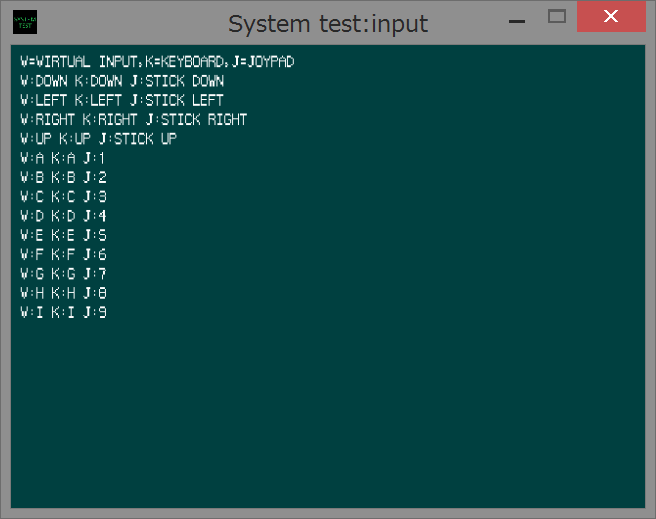

sample04 input
====
This sample shows you how to use input functions. There are three sources of input, i.e, Keyboard, Joypad (A.K.A. Gamepad) and virtual input. Virtual input is a merged and capsulized input of former two hardware sources. Each devices are acquired and checked one time a main loop. Both device are enabled if they are connected to the computer at the launch of application respectively.<br>
Read sample[01,02,03]/README.md before reading this content.<br>


General rules
----
Below things are general rules

 * Keyboard and Joypad are available input device
 * Virtual input must be set before its use

Key codes
----
There are three kinds of input keys corresponding to input sources. These keys are used to indicate the key that you want to know its status through input related functions do.

1. Keyboard key

|Key|Meaning|
|---|---|
|SYS_KEY_ESCAPE|Escape key|
|SYS_KEY_1|1 key|
|SYS_KEY_2|2 key|
|SYS_KEY_3|3 key|
|SYS_KEY_4|4 key|
|SYS_KEY_5|5 key|
|SYS_KEY_6|6 key|
|SYS_KEY_7|7 key|
|SYS_KEY_8|8 key|
|SYS_KEY_9|9 key|
|SYS_KEY_0|0 key|
|SYS_KEY_MINUS|Minus key|
|SYS_KEY_EQUALS|Equals key|
|SYS_KEY_BACK|Back key|
|SYS_KEY_TAB|Tab key|
|SYS_KEY_Q|Q key|
|SYS_KEY_W|W key|
|SYS_KEY_E|E key|
|SYS_KEY_R|R key|
|SYS_KEY_T|T key|
|SYS_KEY_Y|Y key|
|SYS_KEY_U|U key|
|SYS_KEY_I|I key|
|SYS_KEY_O|O key|
|SYS_KEY_P|P key|
|SYS_KEY_LBRACKET|Lbracket key|
|SYS_KEY_RBRACKET|Rbracket key|
|SYS_KEY_RETURN|Return key|
|SYS_KEY_LCONTROL|Lcontrol key|
|SYS_KEY_A|A key|
|SYS_KEY_S|S key|
|SYS_KEY_D|D key|
|SYS_KEY_F|F key|
|SYS_KEY_G|G key|
|SYS_KEY_H|H key|
|SYS_KEY_J|J key|
|SYS_KEY_K|K key|
|SYS_KEY_L|L key|
|SYS_KEY_SEMICOLON|Semicolon key|
|SYS_KEY_APOSTROPHE|Apostrophe key|
|SYS_KEY_GRAVE|Grave key|
|SYS_KEY_LSHIFT|Lshift key|
|SYS_KEY_BACKSLASH|Backslash key|
|SYS_KEY_Z|Z key|
|SYS_KEY_X|X key|
|SYS_KEY_C|C key|
|SYS_KEY_V|V key|
|SYS_KEY_B|B key|
|SYS_KEY_N|N key|
|SYS_KEY_M|M key|
|SYS_KEY_COMMA|Comma key|
|SYS_KEY_PERIOD|Period key|
|SYS_KEY_SLASH|Slash key|
|SYS_KEY_RSHIFT|Rshift key|
|SYS_KEY_MULTIPLY|Multiply key|
|SYS_KEY_LMENU|Lmenu key|
|SYS_KEY_SPACE|Space key|
|SYS_KEY_CAPITAL|Capital key|
|SYS_KEY_F1|F1 key|
|SYS_KEY_F2|F2 key|
|SYS_KEY_F3|F3 key|
|SYS_KEY_F4|F4 key|
|SYS_KEY_F5|F5 key|
|SYS_KEY_F6|F6 key|
|SYS_KEY_F7|F7 key|
|SYS_KEY_F8|F8 key|
|SYS_KEY_F9|F9 key|
|SYS_KEY_F10|F10 key|
|SYS_KEY_KEYLOCK|Keylock key|
|SYS_KEY_SCROLL|Scroll key|
|SYS_KEY_KEYPAD7|Keypad7 key|
|SYS_KEY_KEYPAD8|Keypad8 key|
|SYS_KEY_KEYPAD9|Keypad9 key|
|SYS_KEY_SUBTRACT|Subtract key|
|SYS_KEY_KEYPAD4|Keypad4 key|
|SYS_KEY_KEYPAD5|Keypad5 key|
|SYS_KEY_KEYPAD6|Keypad6 key|
|SYS_KEY_ADD|Add key|
|SYS_KEY_KEYPAD1|Keypad1 key|
|SYS_KEY_KEYPAD2|Keypad2 key|
|SYS_KEY_KEYPAD3|Keypad3 key|
|SYS_KEY_KEYPAD0|Keypad0 key|
|SYS_KEY_DECIMAL|Decimal key|
|SYS_KEY_OEM_102|OEM 102 key|
|SYS_KEY_F11|F11 key|
|SYS_KEY_F12|F12 key|
|SYS_KEY_F13|F13 key|
|SYS_KEY_F14|F14 key|
|SYS_KEY_F15|F15 key|
|SYS_KEY_KANA|Kana key|
|SYS_KEY_ABNT_C1|ABNT C1 key|
|SYS_KEY_CONVERT|Convert key|
|SYS_KEY_NOCONVERT|Noconvert key|
|SYS_KEY_YEN|Yen key|
|SYS_KEY_ABNT_C2|ABNT C2 key|
|SYS_KEY_KEYPADEQUALS|Keypadequals key|
|SYS_KEY_PREVTRACK|Prevtrack key|
|SYS_KEY_AT|At key|
|SYS_KEY_COLON|Colon key|
|SYS_KEY_UNDERLINE|Underline key|
|SYS_KEY_KANJI|Kanji key|
|SYS_KEY_STOP|Stop key|
|SYS_KEY_AX|Ax key|
|SYS_KEY_UNLABELED|Unlabeled key|
|SYS_KEY_NEXTTRACK|Nexttrack key|
|SYS_KEY_KEYPADENTER|Keypadenter key|
|SYS_KEY_RCONTROL|Rcontrol key|
|SYS_KEY_MUTE|Mute key|
|SYS_KEY_CALCULATOR|Calculator key|
|SYS_KEY_PLAYPAUSE|Playpause key|
|SYS_KEY_MEDIASTOP|Mediastop key|
|SYS_KEY_VOLUMEDOWN|Volumedown key|
|SYS_KEY_VOLUMEUP|Volumeup key|
|SYS_KEY_WEBHOME|Webhome key|
|SYS_KEY_KEYPADCOMMA|Keypadcomma key|
|SYS_KEY_DIVIDE|Divide key|
|SYS_KEY_SYSRQ|Sysrq key|
|SYS_KEY_RMENU|Rmenu key|
|SYS_KEY_PAUSE|Pause key|
|SYS_KEY_HOME|Home key|
|SYS_KEY_UP|Up key|
|SYS_KEY_PRIOR|Prior key|
|SYS_KEY_LEFT|Left key|
|SYS_KEY_RIGHT|Right key|
|SYS_KEY_END|End key|
|SYS_KEY_DOWN|Down key|
|SYS_KEY_NEXT|Next key|
|SYS_KEY_INSERT|Insert key|
|SYS_KEY_DELETE|Delete key|
|SYS_KEY_LWIN|Lwin key|
|SYS_KEY_RWIN|Rwin key|
|SYS_KEY_APPS|Apps key|
|SYS_KEY_POWER|Power key|
|SYS_KEY_SLEEP|Sleep key|
|SYS_KEY_WAKE|Wake key|
|SYS_KEY_WEBSEARCH|Websearch key|
|SYS_KEY_WEBFAVORITES|Webfavorites key|
|SYS_KEY_WEBREFRESH|Webrefresh key|
|SYS_KEY_WEBSTOP|Webstop key|
|SYS_KEY_WEBFORWARD|Webforward key|
|SYS_KEY_WEBBACK|Webback key|
|SYS_KEY_MYCOMPUTER|Mycomputer key|
|SYS_KEY_MAIL|Mail key|
|SYS_KEY_MEDIASELECT|Mediaselect key|

2. Joypad key

|Key|Meaning|
|---|---|
|SYS_JOYPAD_KEY_0|button 0|
|SYS_JOYPAD_KEY_1|button 1|
|SYS_JOYPAD_KEY_2|button 2|
|SYS_JOYPAD_KEY_3|button 3|
|SYS_JOYPAD_KEY_4|button 4|
|SYS_JOYPAD_KEY_5|button 5|
|SYS_JOYPAD_KEY_6|button 6|
|SYS_JOYPAD_KEY_7|button 7|
|SYS_JOYPAD_KEY_8|button 8|
|SYS_JOYPAD_KEY_9|button 9|
|SYS_JOYPAD_KEY_10|button 10|
|SYS_JOYPAD_KEY_11|button 11|
|SYS_JOYPAD_KEY_12|button 12|
|SYS_JOYPAD_KEY_13|button 13|
|SYS_JOYPAD_KEY_14|button 14|
|SYS_JOYPAD_KEY_15|button 15|
|SYS_JOYPAD_KEY_16|button 16|
|SYS_JOYPAD_KEY_17|button 17|
|SYS_JOYPAD_KEY_18|button 18|
|SYS_JOYPAD_KEY_19|button 19|
|SYS_JOYPAD_KEY_20|button 20|
|SYS_JOYPAD_KEY_21|button 21|
|SYS_JOYPAD_KEY_22|button 22|
|SYS_JOYPAD_KEY_23|button 23|
|SYS_JOYPAD_KEY_24|button 24|
|SYS_JOYPAD_KEY_25|button 25|
|SYS_JOYPAD_KEY_26|button 26|
|SYS_JOYPAD_KEY_27|button 27|
|SYS_JOYPAD_KEY_28|button 28|
|SYS_JOYPAD_KEY_29|button 29|
|SYS_JOYPAD_KEY_30|button 30|
|SYS_JOYPAD_KEY_31|button 31|
|SYS_JOYPAD_KEY_DOWN|Analog stick/ten key Down|
|SYS_JOYPAD_KEY_LEFT|Analog stick/ten key Left|
|SYS_JOYPAD_KEY_RIGHT|Analog stick/ten key Right|
|SYS_JOYPAD_KEY_UP|Analog stick/ten key Up|

3. Virtual key

|Key|Meaning|
|---|---|
|SYS_VIRTUAL_KEY_DOWN|Down key|
|SYS_VIRTUAL_KEY_LEFT|Left key|
|SYS_VIRTUAL_KEY_RIGHT|Right key|
|SYS_VIRTUAL_KEY_UP|Up key|
|SYS_VIRTUAL_KEY_A|A key|
|SYS_VIRTUAL_KEY_B|B key|
|SYS_VIRTUAL_KEY_C|C key|
|SYS_VIRTUAL_KEY_D|D key|
|SYS_VIRTUAL_KEY_E|E key|
|SYS_VIRTUAL_KEY_F|F key|
|SYS_VIRTUAL_KEY_G|G key|
|SYS_VIRTUAL_KEY_H|H key|
|SYS_VIRTUAL_KEY_I|I key|
|SYS_VIRTUAL_KEY_J|J key|

Input functions
----
These are some functions related to input. Input device is monitored when UpdateSystem function is called. The status of each input sources are stored to buffer. When client calls below input functions, the status buffers are referred.

1. SetVirtualInputKey
```
bool SetVirtualInputKey(SYS_VIRTUAL_KEY virtual_key, SYS_KEY key,
                        SYS_JOYPAD_KEY Joypad_key);
```
This function set the assign of virtual keys to keyboard keys and Joypad keys. This function set one assign at a call. Down, Left, Right and Up keys are fixed and not be changed by this function.

2. SetJoypadThreshold
```
void SetJoypadThreshold(int threshold_x, int threshold_y);
```
This function sets threshold for Joypad analog stick input. The value ranges from 0 to 1000, default is 50. This function may not be needed often.

3. GetKeyboardStatus
```
bool GetKeyboardStatus(SYS_KEY key);
```
This function tells you keyboard key status. If the corresponding key is pressed or activated, this function returns true.

4. GetJoypadStatus
```
bool GetJoypadStatus(SYS_JOYPAD_KEY Joypad_key);
```
This function tells you Joypad key status. If the corresponding key is pressed or activated, this function returns true.

5. GetVirtualInputStatus
```
bool GetVirtualInputStatus(SYS_VIRTUAL_KEY virtual_key);
```
This function tells you virtual key status. If the corresponding key is pressed or activated, this function returns true. Before the call of this function, argument key is must set by SetVirtualInputKey.

5. GetVirtualInputPressed
```
bool GetVirtualInputPressed(SYS_VIRTUAL_KEY virtual_key);
```
This function tells you virtual key status. If the corresponding key is pressed or activated and not so in the last loop, this function returns true. Before the call of this function, argument key is must set by SetVirtualInputKey.
